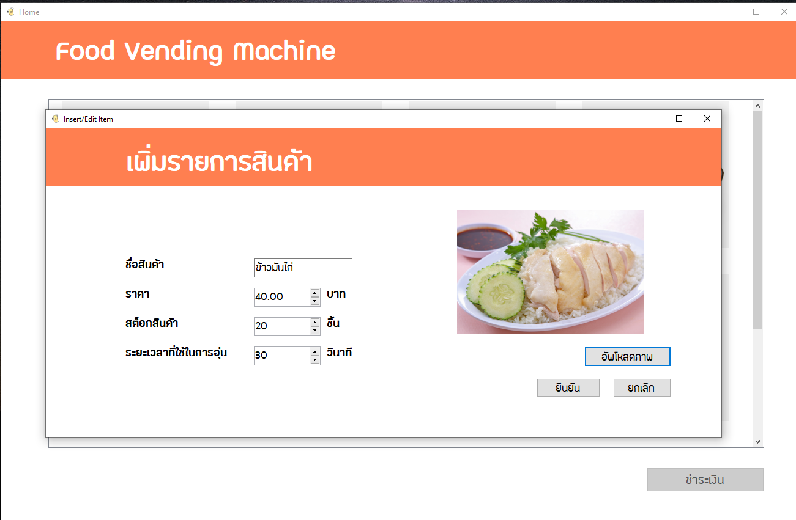

# Food Vending Machine (โปรแกรมจำลองตู้กดอาหาร)

## Requirements

.NET 5.0

[Visual Studio](https://visualstudio.microsoft.com/)

[MongoDB](https://www.mongodb.com/)

## Screenshot

Main Screen

Payment

Add/Edit/Delete Product

Sales Summary

## Team
<table>
  <tr>
    <td align="center"><a href="https://github.com/LagSeeN"> <b>LagSeeN</b></a> Danupol Intranurux Frontend</td>
    <td align="center"><a href="https://github.com/ONMITSU"> <b>ONMITSU</b></a> Yossapon Jantarote Frontend</td></td>
    <td align="center"><a href="https://github.com/Guschamaporn"> <b>Guschamaporn</b></a> Guschamaporn Limpongsanuruk Design</td></td>
    <td align="center"><a href="https://github.com/Natchaya-Yimtanom"> <b>quinn</b></a> Natchaya Yimtanom Design</td></td>
  </tr>
</table>
